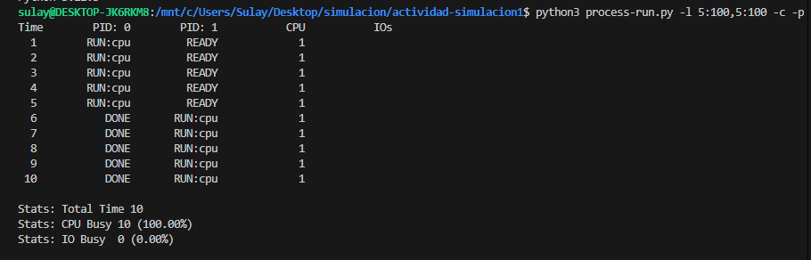
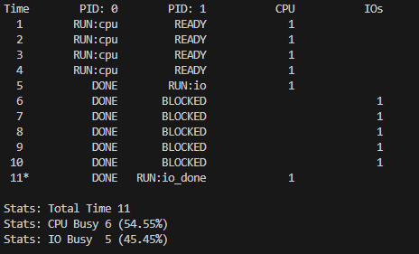
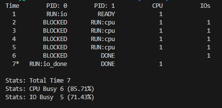
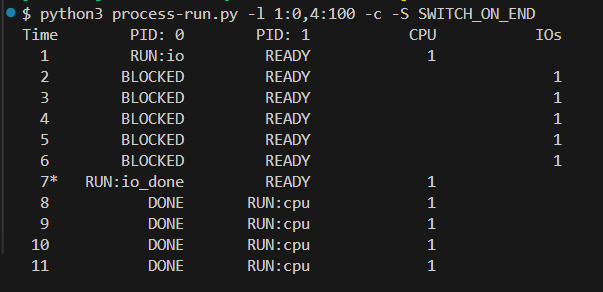
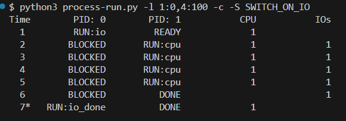
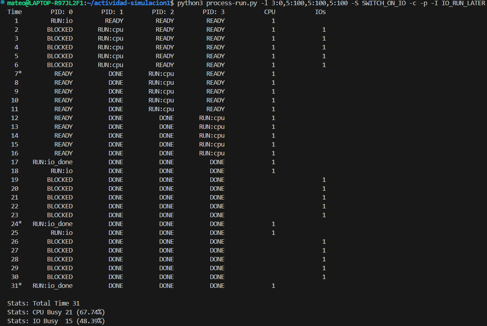
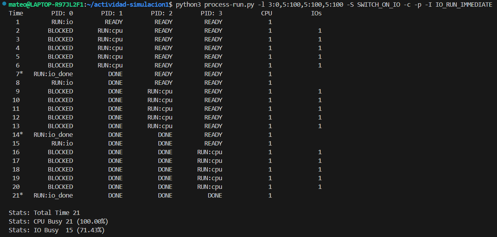

# Actividad de seguimiento - Simulación 1

|Integrante|correo|usuario github|
|----------|------|--------------|
|Juan Sebastian Loaiza Mazo|juans.loaiza@udea.edu.co|juanselm|
|Sulay Gisela Martínez Barreto|sulay.martinez@udea.edu.co|SheeleM|
|Mateo Herrera Londoño|Mateo.herrera2@udea.edu.co|MateoHL|

## Instrucciones

Antes de empezar a realizar esta actividad haga un **fork** de este repositorio y sobre este trabaje en la solución de las preguntas planteadas en la actividad de simulación. Las respuestas deben ser respondidas en español o si lo prefiere en ingles en el lugar señalado para ello (La palabra **answer** muestra donde).

**Importante**:
* Como la actividad es en las parejas del laboratorio, solo uno de los integrantes tiene que hacer el fork; y sobre repositorio bifurcado que se genera, la modificación se realiza en equipo.
* Como la entrega se debe hacer modificando el archivo READNE, se recomienda que consulte mas sobre el lenguaje **Markdown**. En el repo adjuntan dos cheatsheet ([cheat sheet 1](Markdown_Cheat_Sheet.pdf), [cheatsheet 2](markdown-cheatsheet.pdf)) para consulta rapida.
* Entre mas creativo mejor.

## Homework (Simulation)

This program, [`process-run.py`](process-run.py), allows you to see how process states change as programs run and either use the CPU (e.g., perform an add instruction) or do I/O (e.g., send a request to a disk and wait for it to complete). See the [README](https://github.com/remzi-arpacidusseau/ostep-homework/blob/master/cpu-intro/README.md) for details.

### Questions

1. Run `process-run.py` with the following flags: `-l 5:100,5:100`. What should the CPU utilization be (e.g., the percent of time the CPU is in use?) Why do you know this? Use the `-c` and `-p` flags to see if you were right.
   
   <details>
   <summary>Answer</summary>
   <p><b>Comando</b></p>

   ```python
    python3 process-run.py -l 5:100,5:100 -c -p
   ```

     

   <br>

   ##### Explicación.


   Al ejecutat el comando anterior se simulan dos procesos:
   - **PID 0:** Ejecuta 5 instrucciones en la CPU sin realizar ninguna operación de entrada/salida (I/O). Comienza su ejecución de inmediato.
   - **PID 1:** También ejecuta 5 instrucciones en la CPU, pero su ejecución no está condicionada a que el proceso PID 0 termine primero. En este caso, el planificador decide cómo alternar la ejecución de ambos procesos.
   - **-c (Compute Statistics):** Muestra estadísticas detalladas al final de la ejecución, incluyendo el tiempo total de ejecución, el tiempo ocupado de la CPU y el tiempo ocupado en I/O.

     Ayuda a verificar si la CPU estuvo en uso todo el tiempo y si hubo tiempos muertos.
   - **-p (Print Execution Details):**
   Imprime información sobre el estado de los procesos en cada ciclo.

   <br>
   
   ##### Estado de los Procesos en la Simulación

    | PID | Tiempo 1-5| Tiempo 6| Tiempo 7-10 |
    |---|---|---|---|
    | **0** | Está en `RUN: cpu` | El proceso 0 ha terminado (`DONE`). | Ha finalizado (`DONE`). |
    | **1** | Está `READY` esperando su turno. | Ahora el proceso 1 empieza a ejecutarse (`RUN: cpu`). | El proceso 1 sigue ejecutando CPU hasta que termina. |


   ##### Conclusión:
   - Tiempo total 10 → La simulación duró 10 ciclos. <br>
   - CPU ocupada:10 (100%) → La CPU estuvo ocupada todo el tiempo, sin tiempos muertos.<br>
   - IO ocupada 0 (0%) → No hubo operaciones de entrada/salida (I/O).
   - La planificación utilizada es FIFO porque los procesos se ejecutan en el orden en que llegan sin interrupciones.

   </details>
   <br>

   

2. Now run with these flags: `./process-run.py -l 4:100,1:0`. These flags specify one process with 4 instructions (all to use the CPU), and one that simply issues an I/O and waits for it to be done. How long does it take to complete both processes? Use `-c` and `-p` to find out if you were right. 
   
 
   <details>
   <summary>Answer</summary>
   <p><b>Comando</b></p>

   ```python
     python3 process-run.py -l 4:100,1:0 -c -p
   ```

     

   <br>

   ##### Explicación.


   Al ejecutar el comando anterior se simulan dos procesos en 11 intervalos tiempo:
   - **PID 0:** ejecuta 4 instrucciones que usan CPU
   - **PID 1:** Tiene 1 instrucción de I/O (RUN:io), luego espera a que termine. 
   <br>
   
   ##### Estado de los Procesos en la Simulación

   | PID | Tiempo 1-4 | Tiempo 5-10 | Tiempo 11 |
   |-----|------------|-------------|-----------|
   | **0**   | Está en `RUN:cpu`, ejecutando normalmente. | Termina su ejecución (`DONE`). | Ya ha finalizado. |
   | **1**   | Está en `READY`, esperando su turno. | Inicia operación de E/S (`RUN:io`) y luego permanece `BLOCKED` esperando que finalice. | Termina operación de E/S (`RUN:io_done`) y finaliza (`DONE`). |


   ##### Conclusión:
   - El proceso PID 0 fue muy rápido porque solo necesitaba usar la CPU. Terminó en 4 unidades de tiempo sin interrupciones. <br>
   - El proceso PID 1, aunque solo tenía una instrucción, tardó mucho más porque era una operación de entrada/salida (I/O), lo cual lo dejó bloqueado durante 5 unidades de tiempo esperando respuesta.<br>
   - El sistema completo tomó 11 unidades de tiempo para ejecutar ambos procesos, principalmente porque PID 1 estuvo bloqueado esperando que finalizara su I/O.
   - Esto demuestra que las operaciones de I/O pueden causar demoras importantes, incluso cuando los procesos son 
   cortos.
   - El CPU estuvo ocupado durante 6 de los 11 tiempos (54.55%), lo cual es un uso razonablemente bueno.
   - No hubo tiempos muertos de CPU, es decir, en cada unidad de tiempo hubo algún proceso en ejecución o esperando IO, lo cual implica un buen aprovechamiento.
   - La unidad de entrada/salida (IO) estuvo activa durante 5 de los 11 tiempos (45.45%), cuando el proceso 1 se encontraba esperando la finalización de su operación de IO.
   - El IO fue ejecutado en paralelo al tiempo que el CPU finalizaba con PID 0, mostrando una buena sincronización entre CPU e IO.

   </details>
   <br>


3. Switch the order of the processes: `-l 1:0,4:100`. What happens now? Does switching the order matter? Why? (As always, use `-c` and `-p` to see if you were right)
   
 
   <details>
   <summary>Answer</summary>
   <p><b>Comando</b></p>

   ```python
     python3 ./process-run.py -l 1:0,4:100 -c -p
   ```

     

   <br>

   ##### Explicación:


   Al ejecutar este comando se simulan dos procesos en 7 intervalos de tiempo:
   - **PID 0:** Tiene 1 instrución de I/O RUN, luego eespera a que termine
   - **PID 1:** Ejecuta 4 intrucciones que usan CPU. 
   <br>
   
   ##### Estado de los Procesos en la Simulación:

   | PID | Tiempo 1 | Tiempo 2-5 | Tiempo 6 | Tiempo 7 |
   |-----|----------|------------|----------|----------|
   | **0** | Inicia operación de E/S (`RUN:io`) | Permanece `BLOCKED` esperando que finalice su operación I/O | Sigue `BLOCKED` | Termina operación de E/S (`RUN:io_done`) y finaliza (`DONE`) |
   | **1** | Está en `READY`, esperando su turno | Ejecuta sus instrucciones de CPU (`RUN:cpu`) | Termina su ejecución (`DONE`) | Ya ha finalizado |


   ##### Conclusión:
   - Al ejecutar -l 1:0,4:100, el sistema operativo mostró una gestión eficiente mediante multiprogramación.
   - Cuando el primer proceso (PID 0) se bloqueó por I/O, el sistema ejecutó el segundo (PID 1), que usaba CPU. Así, ambos avanzaron en paralelo, logrando un uso eficiente del CPU (85.71%) y del I/O (71.43%).
   - Esto demuestra la efectividad de la política "SWITCH ON IO", que cambia a otro proceso cuando uno se bloquea, reduciendo tiempos muertos y mejorando el rendimiento.
   - El orden de los procesos influye directamente en la eficiencia del sistema, permitiendo una mejor utilización de los recursos
   </details>
   <br>


4. We'll now explore some of the other flags. One important flag is `-S`, which determines how the system reacts when a process issues an I/O. With the flag set to SWITCH ON END, the system will NOT switch to another process while one is doing I/O, instead waiting until the process is completely finished. What happens when you run the following two processes (`-l 1:0,4:100 -c -S SWITCH ON END`), one doing I/O and the other doing CPU work?
   
   <details>
   <summary>Answer</summary>
   <p><b>Comando</b></p>

   ```python
   python3 process-run.py -l 1:0,4:100 -c -S SWITCH_ON_END
   ```

   

   <br>

   ##### Explicación:

   Al ejecutat el comando anterior se simulan dos procesos:
   - **PID 0:** Este proceso ejecuta una operación de I/O.
   - **PID 1:** Este proceso ejecuta instrucciones sobre la CPU.
   - **SWITCH_ON_END:** Esta opción usada en el comando indica que solo puede ser intercambiado los procesos cuan se termine la ejecución del primero.

   <br>

   |PID|Tiempo 1|Tiempo 2-6|Tiempo 7|Tiempo 8-11|
   |---|---|---|---|---|
   |**0**|Está en ejecución con una operación de I/O.|Permanece en estado BLOCKED|Finaliza su proceso I/O|Ha finalizado (DONE).|
   |**1**|Está READY esperando su turno|Permanece READY sin ejecución.|Continua en estado Ready|Inicia ejecución en CPU hasta terminar|

   ##### Conclusión:
   El cambio de proceso solo ocurre cuando uno termina, en este caso hasta que termine el PID 0. Esto causa ineficiencia, ya que la CPU está inactiva durante el tiempo en que PID 0 está bloqueado y luego de eso el PID 1 puede iniciar su ejecución.

   </details>
   <br>

5. Now, run the same processes, but with the switching behavior set to switch to another process whenever one is WAITING for I/O (`-l 1:0,4:100 -c -S SWITCH ON IO`). What happens now? Use `-c` and `-p` to confirm that you are right.
   
   <details>
   <summary>Answer</summary>
   <p><b>Comando</b></p>

   ```python
   python3 process-run.py -l 1:0,4:100 -c -S SWITCH_ON_IO
   ```

   
   <br>

   ##### Explicación:

   Al ejecutat el comando anterior se simulan dos procesos:
   - **PID 0:** Este proceso ejecuta una operación de I/O.
   - **PID 1:** Este proceso ejecuta instrucciones sobre la CPU.
   - **SWITCH_ON_IO:** Cuando uno de los procesos entra en estado I/O se puede cambiar de proceso.

   <br>

   |PID|Tiempo 1|Tiempo 2-6|Tiempo 7|Tiempo 8-11|
   |---|---|---|---|---|
   |**0**|Empieza la ejecución con una operación de I/O|Se queda en estado BLOCKED esperando su I/O.|Permanece bloqueado esperando el fin de su I/O. |finaliza su proceso I/O|
   |**1**|Inicia su estado en READY|Usa la CPU (RUN: cpu) sin necesidad de que PID 0 halla terminado.|Finaliza su proceso|Ya ha finalizado su proceso|

   ##### Conclusión:
   En este caso se optimiza el uso de la CPU, ya que mientras PID 0 está bloqueado esperando la I/O, PID 1 usa la CPU, evitando tiempos muertos.

   </details>
   <br>

6. One other important behavior is what to do when an I/O completes. With `-I IO RUN LATER`, when an I/O completes, the process that issued it is not necessarily run right away; rather, whatever was running at the time keeps running. What happens when you run this combination of processes? (`./process-run.py -l 3:0,5:100,5:100,5:100 -S SWITCH ON IO -c -p -I IO RUN LATER`) Are system resources being effectively utilized?
   
   <details>
   <summary>Answer</summary>
   ```python
   python3 process-run.py -l 3:0,5:100,5:100,5:100 -S SWITCH_ON_IO -c -p -I IO_RUN_LATER
   ```
   
   <br>

   ##### Explicación:
   se definen 4 procesos:

   - PID 0 comienza con una operación de entrada/salida (I/O), y luego alterna tres ráfagas de CPU de 5 unidades de tiempo.
   - PID 1, 2 y 3 ejecutan únicamente ráfagas de CPU, cada uno con 5 unidades.

   Los modificadores usados son:

   - -S SWITCH_ON_IO: el planificador realiza un cambio de contexto cuando un proceso entra en I/O.
   - -I IO_RUN_LATER: cuando un proceso finaliza su operación de I/O, no se ejecuta inmediatamente, sino que se coloca al final de la cola de listos.
   - -c -p: muestran estadísticas y el patrón de ejecución completo.

   Durante la simulación, el proceso 0 empieza con una operación de I/O (RUN:io) y se bloquea (BLOCKED). En ese momento, gracias al planificador, la CPU cambia rápidamente a los procesos listos (PID 1, 2 y 3), que se ejecutan de manera continua hasta completarse.

   Cuando el PID 0 termina su I/O, no se ejecuta inmediatamente, sino que se reubica al final de la cola por efecto de IO_RUN_LATER. Por eso, solo vuelve a ejecutarse después de que los demás procesos hayan terminado. Esto mismo ocurre con sus siguientes operaciones de I/O, generando periodos de espera incluso cuando el proceso ya está listo para continuar.

   **¿Se están utilizando eficazmente los recursos del sistema?**
   En términos generales, el sistema logra un buen uso de recursos, con un uso de CPU del 67.74% y un uso de I/O del 48.39%. La CPU no queda ociosa mientras haya procesos listos, y se mantiene activa durante la mayoría de la ejecución.

   Sin embargo, la política IO_RUN_LATER introduce una cierta ineficiencia: los procesos que terminan su operación de I/O no se ejecutan inmediatamente, lo que puede llevar a pequeños periodos donde no hay procesos listos, a pesar de que uno ya está preparado para continuar. Esto genera tiempos muertos evitables tanto en CPU como en I/O, y se nota especialmente hacia el final de la simulación, cuando ya solo queda el PID 0.

   ##### Conclusión:
   Aunque el rendimiento general del sistema es aceptable, la decisión de postergar la ejecución de un proceso que acaba de finalizar su I/O limita la eficiencia global. Esta combinación de parámetros muestra cómo una política aparentemente simple puede afectar el aprovechamiento de los recursos, y resalta la importancia de tomar decisiones inteligentes en la planificación, especialmente en sistemas donde la interacción entre procesos y dispositivos de entrada/salida es constante.

   </details>
   <br>

7. Now run the same processes, but with `-I IO RUN IMMEDIATE` set, which immediately runs the process that issued the I/O. How does this behavior differ? Why might running a process that just completed an I/O again be a good idea?
   
   <details>
   <summary>Answer</summary>
   ```python
   python3 process-run.py -l 3:0,5:100,5:100,5:100 -S SWITCH_ON_IO -c -p -I IO_RUN_IMMEDIATE
   ```
   
   <br>

   ##### Explicación:
   Se definen 4 procesos:

   - PID 0 comienza con una operación de entrada/salida (I/O) y luego ejecuta tres ráfagas de CPU.
   - PID 1, 2 y 3 ejecutan tareas de CPU de 5 unidades de tiempo cada uno.
   - Se utiliza -S SWITCH_ON_IO, lo que hace que el planificador cambie de contexto cuando un proceso entra en I/O.
   - La gran diferencia es el parámetro -I IO_RUN_IMMEDIATE, que hace que el proceso que finaliza una operación de I/O se ejecute      inmediatamente, dándole prioridad sobre otros procesos listos.

   Durante la simulación, el PID 0 inicia con una operación de I/O y se bloquea. La CPU entonces ejecuta el PID 1. Una vez que el PID 0 termina su I/O, es reinsertado inmediatamente en la CPU antes que los demás procesos listos, y realiza su ráfaga de CPU.

   Este patrón se repite: el PID 0 ejecuta una ráfaga, vuelve a entrar a I/O, y cuando esta finaliza, vuelve a ejecutarse de inmediato. Así, se alternan periodos de CPU e I/O de forma más intercalada, hasta que el proceso 0 finaliza. Solo después se ejecutan los PIDs 2 y 3.

   **¿Qué diferencia este comportamiento respecto a la pregunta 6?**
   La diferencia principal es la prioridad que se le da al proceso que termina su operación de I/O:

   - En la pregunta 6 (IO_RUN_LATER), el proceso que completaba su I/O iba al final de la cola de listos, y debía esperar su turno nuevamente. Esto introducía demoras innecesarias y afectaba la eficiencia del sistema.
   - En la pregunta 7 (IO_RUN_IMMEDIATE), el proceso que termina I/O se ejecuta inmediatamente, lo cual reduce los tiempos de espera y mejora el flujo entre I/O y CPU.

   Este cambio tiene un impacto directo en el aprovechamiento de recursos:

   | Métrica             | Pregunta 6 (`IO_RUN_LATER`) | Pregunta 7 (`IO_RUN_IMMEDIATE`) |
   |---------------------|-----------------------------|----------------------------------|
   | Tiempo total        | 31                          | 21                               |
   | Uso de CPU          | 21 (67.74%)                 | 21 (100.00%)                     |
   | Uso de I/O          | 15 (48.39%)                 | 15 (71.43%)                      |

   La mejora es clara: con IO_RUN_IMMEDIATE, el sistema logra terminar más rápido y utiliza al máximo tanto la CPU como el dispositivo 
   de I/O.

   **¿Por qué es buena idea ejecutar de nuevo un proceso que acaba de completar una E/S?**
   Porque el proceso que acaba de terminar una operación de entrada/salida probablemente ya tiene trabajo pendiente (como una nueva ráfaga de CPU), y está listo para continuar su ejecución inmediatamente.

   Al ejecutarlo de nuevo sin esperar, se logra:

   - Mayor fluidez en la ejecución, evitando que el proceso quede en espera cuando ya podría seguir trabajando.
   - Reducción de tiempos de espera innecesarios, tanto para la CPU como para los dispositivos de I/O.
   - Mejor utilización del sistema, como se refleja en los resultados de esta simulación.

   ##### Conclusión:
   La política IO_RUN_IMMEDIATE demuestra ser mucho más eficiente que IO_RUN_LATER. Al dar prioridad al proceso que termina una operación de I/O, el sistema logra mayor paralelismo, menos tiempo total de ejecución y mejor aprovechamiento de los recursos.

   Este caso es un buen ejemplo de cómo una pequeña decisión en la planificación puede tener un gran impacto en el rendimiento general del sistema.
   </details>
   <br>


### Criterios de evaluación
- [x] Despligue de los resultados y analisis claro de los resultados respecto a lo visto en la teoria.
- [x] Creatividad y orden.
